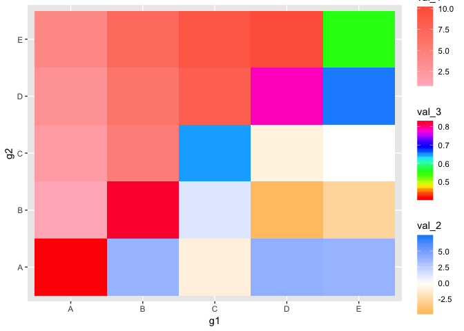
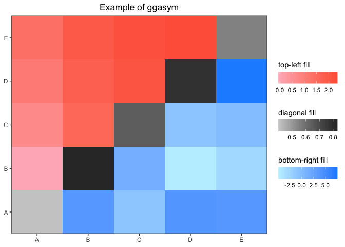

ggasym <a href="https://jhrcook.github.io/ggasym/index.html">  </a>
======================================================================================================================================

[](https://www.gnu.org/licenses/gpl-3.0) [](https://jhrcook.github.io/ggasym/index.html) [](https://travis-ci.org/jhrcook/ggasym) [](https://codecov.io/github/jhrcook/ggasym?branch=master)

ggasym (pronounced "gg-awesome") plots a symmetric matrix with two different fill aesthetics for the top-left and bottom-right triangles. It operates within the Grammar of Graphics paradigm implemented in [ggplot2](https://ggplot2.tidyverse.org).

**author: Joshua H. Cook**

**date: 2019-02-22**

**Asymmetric Matrix Plotting in ggplot**

Checkout the documentation and vignettes at the pkgdown website [https://jhrcook.github.io/ggasym/](https://jhrcook.github.io/ggasym/index.html)

Download and Installation
-------------------------

You can download and install from the GitHub repo.

``` r
devtools::install_github("jhrcook/ggasym")
```

And load the package with the standard `library` function.

``` r
library(ggasym)
```

Basic Usage
-----------

Here is a basic example. `tib` is a "tibble" (ie. fancy "data.frame") of comparisons between groups "A" through "E". There are two values to be plotted, `val_1` and `val_2`, that hold data on the comparison between `g1` and `g2`. `tib` is first passed to `asymmetrise` to fill in all the missing combinations between `g1` and `g2` such that the symmetric matrix can be built. All added values take the value `NA`. The modified data table is finally passed to `ggplot` and `geom_asymmat` is added on.

``` r
tib <- tibble(g1 = c("A", "A", "A", "A", "B", "B", "B", "C", "C", "D"),
              g2 = c("B", "C", "D", "E", "C", "D", "E", "D", "E", "E"),
              val_1 = seq(1, 10, 1),
              val_2 = rnorm(10, mean = 0, sd = 3))
tib <- asymmetrise(tib, g1, g2)
ggplot(tib, aes(x = g1, y = g2)) +
    geom_asymmat(aes(fill_tl = val_1, fill_br = val_2)) +
    scale_fill_tl_gradient(low = "lightpink", high = "tomato") +
    scale_fill_br_gradient(low = "lightblue1", high = "dodgerblue")
```


The new aesthetics `fill_tl` and `fill_br` behave just like the normal `fill`, except that they correspond to the top-left ("tl") and bottom-right ("br") triangles of the matrix, respectively. This package also includes analogous functions for scaling the fill colors such as `scale_fill_tl_gradient2` and `scale_fill_br_gradientn` that operate just as expected when using ggplot2.

``` r
ggplot(tib) +
    geom_asymmat(aes(x = g1, y = g2, fill_tl = val_1, fill_br = val_2)) +
    scale_fill_tl_gradient(low = "lightpink", high = "tomato") +
    scale_fill_br_gradient2(low = "orange", mid = "white", high = "dodgerblue")
```



Since the new geom is a normal ggplot2 object, it can be introduced into a standard ggplot2 workflow. Note that the labels can be adjusted like normal using the `labs` function and using the `fill_tl` and `fill_br` arguments.

``` r
ggplot(tib) +
    geom_asymmat(aes(x = g1, y = g2, fill_tl = log(val_1), fill_br = val_2)) +
    scale_fill_tl_gradient(low = "lightpink", high = "tomato") +
    scale_fill_br_gradient(low = "lightblue1", high = "dodgerblue") +
    labs(fill_tl = "top-left fill", fill_br = "bottom-right fill",
         title = "Example of ggasym") +
    theme_bw() +
    theme(axis.title = element_blank(),
          plot.title = element_text(hjust = 0.5),
          panel.background = element_rect(fill = "grey70"),
          panel.grid = element_blank()) +
    scale_x_discrete(expand = c(0, 0)) +
    scale_y_discrete(expand = c(0, 0))
```



------------------------------------------------------------------------

I would like to thank the team behind [ggplot2](https://ggplot2.tidyverse.org) for creating a flexible and powerful package for the R community.

Logo made with <a href="https://www.designevo.com/en/" title="Free Online Logo Maker">DesignEvo</a>
